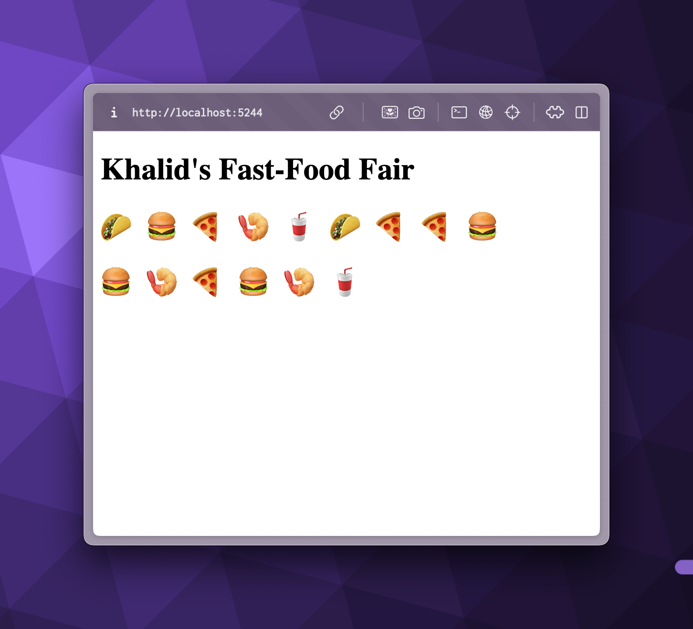

# Server-Sent Events Demo with .NET

A real-time food order tracking application demonstrating Server-Sent Events (SSE) implementation using .NET. This
project showcases how to create a live-updating web interface for monitoring food orders in a fast-food setting.



## Features

- Real-time order updates using Server-Sent Events
- Clean and minimal UI design
- Built with .NET 10.0
- Dependency injection using Injectio

## Technology Stack

- ASP.NET Core
- Server-Sent Events (SSE)
- HTML/JavaScript
- [Injectio](https://github.com/loresoft/Injectio) for dependency injection

## Getting Started

1. Clone the repository
2. Ensure you have .NET 10.0 SDK installed
3. Run the following commands:

```bash
dotnet run
```
